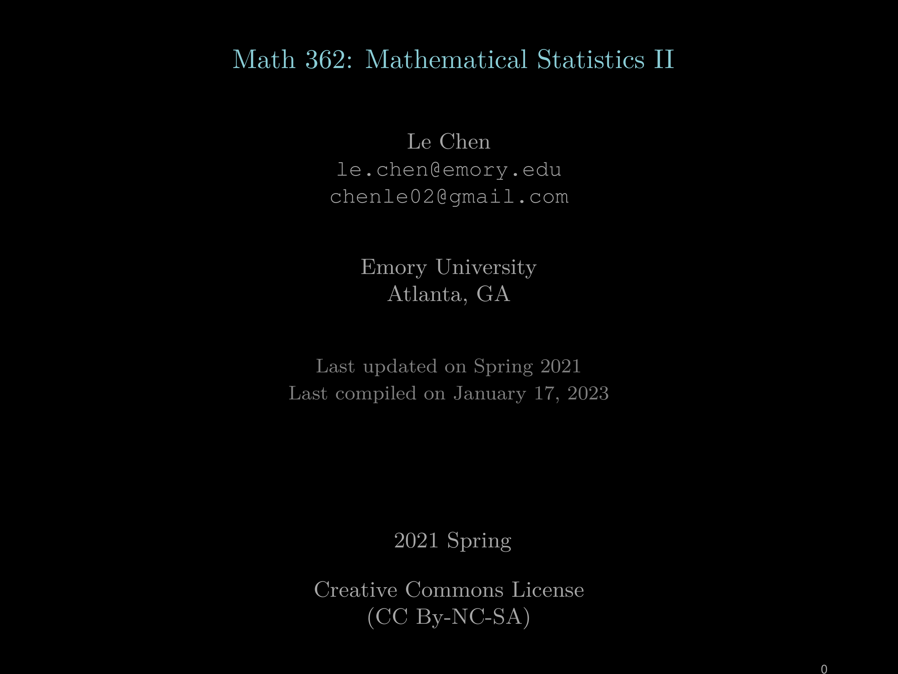
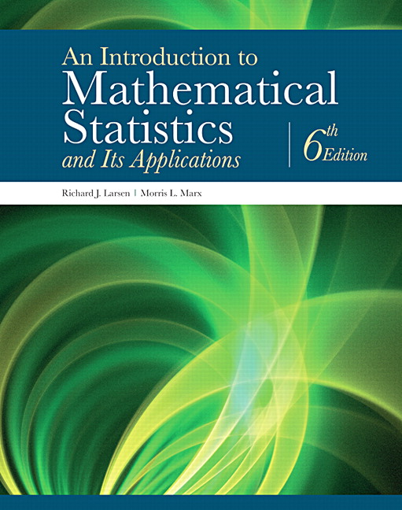

[](https://doi.org/10.5281/zenodo.10206720)



# Statistics: Open slides
1. In this repo, we share the slides for the course "Math 362 -- Mathematical Statistics II"
   in the Department of Mathematics, Emory University, taught by me in 2021 Spring.
2. This second part of the sequence of probability and statistics course that covers
   the statistics part. The text book is:
   *  "An Introduction to Mathematical Statistics", by Richard J. Larsen and Morris L. Marx, 6th Ed.
   *  
3. The course page can be found here: 
   * [Math 362 Mathematical Statistics II at Emory](http://math.emory.edu/~lchen41/teaching/2020_Spring/math362_2020_Spring.html)
   * [Math 362 Mathematical Statistics II, mirror (refined) at Auburn](http://webhome.auburn.edu/~lzc0090/teaching/2021_Spring_Math362/)
4. All slides and compiling methods are in the folder [slides](./slides)
5. We hope that the resources have been supportive in your teaching or studying.
   We are sincerely grateful for any form of acknowledgment you might extend.
   Should you wish to mention this work, please feel free to use the following
   BibTeX entry. Your support in recognizing the effort put into compiling and
   maintaining this repository is much appreciated.

   * Le Chen (2023) “Statistics: open slides”. GitHub & Zenodo. https://doi.org/10.5281/zenodo.10206720

```
@misc{chen:23:statistics,
  author        = {Le Chen},
  title         = {Statistics: Open Slides},
  month         = {nov},
  year          = {2023},
  publisher     = {GitHub \& Zenodo},
  journal       = {GitHub repository},
  doi           = {10.5281/zenodo.10206720},
  url           = {https://doi.org/10.5281/zenodo.10206720}
}
```

# Acknowledgment
* Professor and department chair [Jim Nagy](http://www.math.emory.edu/~nagy/) for his encouragement and support.
* Professor [Bree Ettinger](http://www.math.emory.edu/~betting/) for her help in the course.

# License
* Creative Commons License (CC BY-NC-SA) 
* License details can be found at the [official website](https://creativecommons.org/licenses/by-nc-sa/4.0/) or [here](LICENSE.txt).
